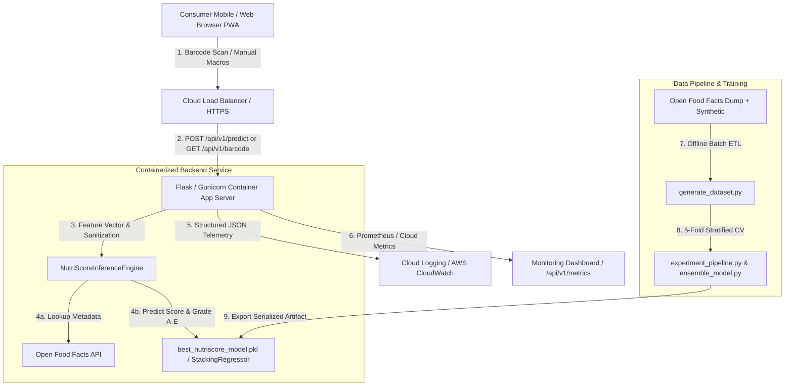

# Step 10: Design Your Deployment Solution — NutriScore
**Machine Learning Engineering & AI Bootcamp Capstone — Phase 2**

---

## 1. End-to-End Production Architecture Diagram

---

## 2. Monitoring, Logging, and Debugging Plan
1. **Structured JSON Telemetry (`src/monitoring/logger.py`):**
   - Every API request is logged as structured JSON containing `timestamp`, `path`, `status_code`, `latency_ms`, `model_version`, `prediction`, and `grade`.
   - Allows instant log querying in Google Cloud Logging or AWS CloudWatch.
2. **Real-Time Prometheus & Health Probes:**
   - **`/api/v1/health`:** Liveness probe checked every 30 seconds by container orchestration to verify model uptime and readiness.
   - **`/api/v1/metrics`:** Exposes P50/P95/P99 latency percentiles, total request counts, error rates, and grade distribution (`A`–`E`) to detect data drift or prediction skew.
3. **Debugging Strategy:**
   - If `best_nutriscore_model.pkl` is missing or fails version checks, `NutriScoreInferenceEngine` automatically logs a warning and falls back to our deterministic analytical heuristic scoring engine without crashing client sessions.
