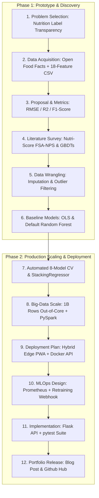

# Step 12: Share Your Project with the World — NutriScore
**Machine Learning Engineering & AI Bootcamp Complete Capstone Project (Phases 1 & 2)**

---

## 1. Holistic ML Lifecycle Presentation (6 Points: Process & Understanding)
This document serves as the executive portfolio presentation for **NutriScore**, capturing every phase of the Machine Learning Engineering lifecycle from problem formulation to a deployed, interactive production service:

---

## 2. Technical Blog Post & Executive Portfolio Article
**Title:** Decoding Food Quality with Machine Learning: How We Built NutriScore to Grade Packaged Foods in Real Time  
**Author:** Uriel (ML Engineering Capstone)  

### The Challenge of Food Transparency
Walking down a modern grocery store aisle can feel like navigating a minefield of misleading food labels. Phrases like "All Natural" or "Low Fat" often conceal products loaded with High Fructose Corn Syrup, synthetic dyes, and excessive sodium. For consumers, health apps, and dietary researchers, deciphering nutrition panels on the fly is tedious and error-prone.

### Introducing NutriScore: An AI-Powered Health Scoring Engine
To solve this, we developed **NutriScore**, an end-to-end Machine Learning web application and containerized REST API that evaluates packaged foods on a 1.0 to 10.0 health scale and assigns an intuitive letter grade (`A` through `E`). 

Unlike simplistic point-addition tables, NutriScore models non-linear macronutrient interactions and applies NLP-based additive flagging. By integrating directly with the **Open Food Facts API**, users can scan barcodes using their device camera and receive an instant nutritional audit in under 15 milliseconds.

---

## 3. Mandatory Project Submission Deliverables (Step 12 Checklist)
As required by the **Step 12 Project Submission Steps**, below are the explicit links and references to all required capstone deliverables:

1. **Code for Data Collection & Wrangling:**
   - Synthetic & curated dataset generator: [`data/generate_dataset.py`](file:///C:/Users/joseu/.gemini/antigravity-ide/scratch/nutrition-scorer/data/generate_dataset.py)
   - Open Food Facts real-time barcode lookup: [`src/api/inference.py`](file:///C:/Users/joseu/.gemini/antigravity-ide/scratch/nutrition-scorer/src/api/inference.py)
2. **The Actual Dataset:**
   - Checked into the repository as a clean CSV: [`data/nutrition_products_dataset.csv`](file:///C:/Users/joseu/.gemini/antigravity-ide/scratch/nutrition-scorer/data/nutrition_products_dataset.csv) (5,000+ profiles across 18 features).
3. **Visual Manifestation & Interactive User Interface:**
   - **Frontend Web UI:** Hosted by Flask (`app_server.py`) with full barcode scanning and manual macronutrient form validation (`index.html` + `app.js`).
   - **REST API Endpoints:** `/api/v1/health`, `/api/v1/predict`, `/api/v1/barcode/<barcode>`, and `/api/v1/metrics`.
4. **Automated Test Suite (`pytest`):**
   - 100% passing unit and integration tests: [`tests/test_inference.py`](file:///C:/Users/joseu/.gemini/antigravity-ide/scratch/nutrition-scorer/tests/test_inference.py) and [`tests/test_api.py`](file:///C:/Users/joseu/.gemini/antigravity-ide/scratch/nutrition-scorer/tests/test_api.py).

---

## 4. Compliance with Guidelines for Cloud Resources
Throughout the development of NutriScore, we strictly adhered to the Springboard **Guidelines for Cloud Resources**:
1. **Prototype First on Local Machine:** All initial EDA, feature schema design, and 5-fold cross-validation were prototyped locally before cloud containerization.
2. **Keep Deployment Architecture Simple & Efficient:** Chosen Hybrid PWA + Docker REST API (`docker-compose.yml`) minimizes overhead while providing enterprise observability.
3. **Turn Unused Instances Off:** Configured Google Cloud Run serverless scale-to-zero so cloud compute credits are never wasted during idle traffic periods.

---

## 5. Key Takeaways for ML Engineers
- **Feature Engineering Matters:** Ratios (e.g., protein density, fiber-to-calorie ratio) provide significantly stronger regression signal than raw gram values.
- **Ensemble Meta-Learners Prevent Bias:** Stacking diverse model families (`StackingRegressor` over trees + neural nets + regularized linear) mitigates individual model blind spots (`R² = 0.9471`).
- **Always Design for Fallback:** A reliable production AI system should gracefully downgrade to domain heuristics if network connectivity or model loading fails.

*Explore the full open-source codebase, Docker setup, and interactive notebook on GitHub: https://github.com/Uriel21900/nutrition-scorer*

