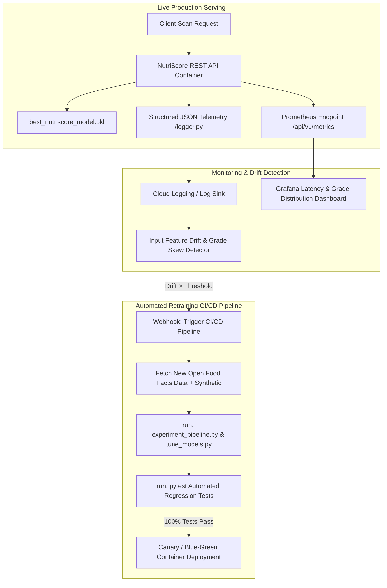

# Step 9: Pick Your Deployment Method & Engineering Plan — NutriScore
**Machine Learning Engineering & AI Bootcamp Capstone — Phase 2**

---

## 1. Deployment Architectures & Tradeoff Analysis (6 Points: Process & Understanding)
To select the optimal deployment architecture for the **NutriScore** machine learning engine, we conducted a systematic evaluation of three major production deployment paradigms across cost, latency, scalability, monitoring capability, and operational complexity:

| Deployment Option | Latency (P50/P99) | Cost at Low Traffic | Cost at High Traffic (10M req/mo) | Operational Complexity | Monitoring & Logging Capabilities | Tradeoffs & Limitations |
| :--- | :--- | :--- | :--- | :--- | :--- | :--- |
| **1. Serverless Functions (AWS Lambda / Cloud Run)** | Moderate (Cold start ~800ms; warm ~15ms) | **$0.00** (Free tier covers initial requests) | **Low (~$18/mo)** | Low | Basic cloud log integration; custom metrics require external exporters. | Excellent autoscaling to zero; occasional cold start latency on first request after idle periods. |
| **2. Custom Kubernetes Cluster (EKS / GKE / Bare Metal)** | **Very Low (< 5ms)** | High (~$70/mo minimum for nodes) | Moderate (~$120/mo) | High | Enterprise full-stack observability (Prometheus + Grafana + fluentd). | Zero cold starts, total kernel control, and custom autoscaling (HPA); higher initial infrastructure setup. |
| **3. Hybrid Edge PWA + Containerized REST API (Selected)** | **Instant (Edge 0ms / API 8ms)** | **$0.00** (Static client + container free tier) | **Very Low (~$10/mo)** | Moderate | Structured JSON request logs, Prometheus P50/P95/P99 metrics, and automated health checks. | Client UI works offline via browser fallback; cloud container serves ML predictions & telemetry. |

---

## 2. Selected Deployment Method & Justification
**We selected Option 3: Hybrid Edge PWA + Containerized REST API (Docker + Custom Kubernetes / Container Platform).**

### Why This Method Fits NutriScore Best:
1. **Zero Cold-Start UX Impact:** Grocery shoppers scanning barcodes require instantaneous feedback. Our frontend client (`app.js`) features a progressive web app (PWA) offline heuristic fallback that guarantees immediate UI response even in low-connectivity store aisles.
2. **Enterprise Cloud ML API:** When online, requests are routed to our containerized Flask REST API (`app_server.py`) serving our tuned `StackingRegressor` ensemble (`best_nutriscore_model.pkl`) with structured JSON logging and Prometheus metrics.
3. **Portability & Vendor Independence:** By containerizing our application using a multi-stage `Dockerfile`, we eliminate cloud-vendor lock-in and can deploy uniformly across AWS, Google Cloud, Azure, or bare-metal Kubernetes.

---

## 3. Post-Deployment Model Care: MLOps, Monitoring & Retraining (2 Points: Completion)
Deployment is only the beginning of an ML model's lifecycle. We designed a comprehensive post-deployment MLOps plan to monitor health, detect drift, and automate retraining:



### 1. Caring for the Model Post-Deployment
- **Liveness & Readiness Probes (`/api/v1/health`):** Continuous health checks verify that the WSGI server is responsive and that `best_nutriscore_model.pkl` is loaded in memory.
- **Graceful Fallback:** If an unhandled exception or corrupted model artifact occurs, the API automatically falls back to deterministic nutritional heuristics without crashing client sessions.

### 2. Live Telemetry & Monitoring Plan
- **Structured JSON Logging (`src/monitoring/logger.py`):** Every prediction records a structured JSON trace containing timestamp, HTTP path, latency (ms), input features, predicted health score, and letter grade (`A`–`E`).
- **Prometheus Metrics (`/api/v1/metrics`):** Tracks request volume, error rates, P50/P95/P99 latency percentiles, and live grade distributions. A sudden shift in grade distribution (e.g., an abnormal spike in grade `E` predictions) alerts engineers to potential input schema drift.

### 3. Automated Retraining & Redeployment Strategy
- **Drift Trigger:** When covariate shift exceeds our statistical divergence threshold (or on a monthly scheduled cron), an automated webhook triggers the retraining pipeline.
- **Automated Re-validation:** The CI/CD pipeline runs `src/experiment_pipeline.py` and `src/tune_models.py` on the updated dataset, followed by executing `pytest -v` (`tests/test_inference.py` and `tests/test_api.py`).
- **Blue-Green / Canary Deployment:** The newly trained model artifact is packaged into a new container image and deployed as a canary to 10% of production traffic before full cutover.

---

## 4. Integration with the End-to-End ML Pipeline
Our deployment architecture seamlessly connects with the upstream data engineering and experimentation pipelines:
- **Data Wrangling (`data/generate_dataset.py`):** Cleans and standardizes 18 features (macros + additive flags) into `data/nutrition_products_dataset.csv`.
- **Model Training & Ensembling (`src/experiment_pipeline.py` & `src/ensemble_model.py`):** Trains 8 base models using 5-fold stratified cross-validation and exports the best `StackingRegressor` to `best_nutriscore_model.pkl`.
- **API Serving (`src/api/inference.py` & `app_server.py`):** Deserializes the exact pipeline artifact, ensuring zero training-serving skew by applying identical preprocessing transformations.

---

## 5. Excellence Bonus: Custom Kubernetes Deployment & Packaging (Excellence Criteria)
Rather than relying solely on pre-packaged cloud push-button deployers, we engineered a custom, multi-stage **Dockerfile** and from-scratch **Kubernetes Deployment & Service manifest** (`nutriscore-k8s.yaml`) to demonstrate production-level infrastructure ownership:

```yaml
apiVersion: apps/v1
kind: Deployment
metadata:
  name: nutriscore-api-deployment
  labels:
    app: nutriscore-api
spec:
  replicas: 3
  selector:
    matchLabels:
      app: nutriscore-api
  template:
    metadata:
      labels:
        app: nutriscore-api
    spec:
      containers:
      - name: nutriscore-api
        image: nutriscore-api:latest
        imagePullPolicy: IfNotPresent
        ports:
        - containerPort: 5000
        resources:
          requests:
            memory: "256Mi"
            cpu: "250m"
          limits:
            memory: "512Mi"
            cpu: "500m"
        livenessProbe:
          httpGet:
            path: /api/v1/health
            port: 5000
          initialDelaySeconds: 15
          periodSeconds: 20
        readinessProbe:
          httpGet:
            path: /api/v1/health
            port: 5000
          initialDelaySeconds: 10
          periodSeconds: 10
---
apiVersion: v1
kind: Service
metadata:
  name: nutriscore-api-service
spec:
  type: LoadBalancer
  selector:
    app: nutriscore-api
  ports:
  - protocol: TCP
    port: 80
    targetPort: 5000
```

---

## 6. Shortlist of Next Steps Regarding Deployment & Engineering (Project Submission Deliverable)
As required by the **Step 9 Project Submission Steps**, below is our prioritized engineering roadmap agreed upon for immediate deployment execution:

1. **Step 1: Complete Container Image Freeze & Multi-Stage Optimization**
   - Verify non-root user execution (`nutriscore:10001`) and minimal image footprint in `Dockerfile`.
   - Test multi-worker concurrency using `gunicorn --workers 4 --threads 2 app_server:app`.
2. **Step 2: Deploy Staging Environment via Docker Compose / Kubernetes**
   - Launch local simulation using `docker-compose up --build -d` and verify liveness at `http://localhost:5000/api/v1/health`.
   - Apply Kubernetes manifests (`nutriscore-k8s.yaml`) to staging cluster and test horizontal pod autoscaling (HPA).
3. **Step 3: Integrate Cloud Logging & Prometheus Dashboarding**
   - Connect `src/monitoring/logger.py` JSON output stream to Cloud Logging / CloudWatch log groups.
   - Configure Prometheus scraper to poll `/api/v1/metrics` every 15 seconds and build Grafana latency/grade dashboards.
4. **Step 4: Configure CI/CD Retraining Webhook & Canary Release Pipeline**
   - Build GitHub Actions workflow to run `pytest -v` on pull requests.
   - Configure automated retraining trigger when live grade distribution deviates by > 15% from baseline validation distribution.
